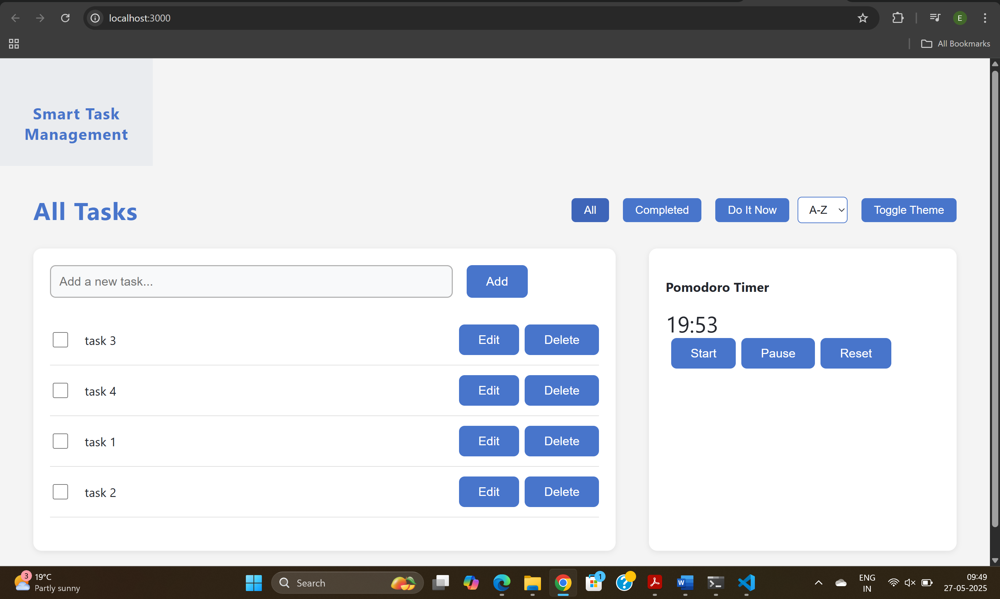

# Smart Task Manager

A modern React-based task manager app with filtering, sorting, drag-and-drop reordering, dark/light mode, and productivity tools.

## Dashboard Preview



## How React Hooks Are Used

| Hook             | Use Case 1                        | Use Case 2                        | Example Code                                      |
|------------------|-----------------------------------|------------------------------------|---------------------------------------------------|
| `useState`       | Store task list                   | Toggle task completion             | `const [tasks, setTasks] = useState([]);`         |
| `useEffect`      | Sync tasks to localStorage        | Load tasks on mount                | `useEffect(() => { localStorage.setItem(...); }, [tasks]);` |
| `useReducer`     | Manage task list                  | Handle timer logic                 | `const [tasks, dispatch] = useReducer(reducer, []);` |
| `useRef`         | Focus input                       | Track timer interval ID            | `const inputRef = useRef();`                      |
| `useContext`     | Theme context                     | Task stats context                 | `const { theme } = useContext(ThemeContext);`      |
| `useMemo`        | Memoize filtered tasks            | Memoize completion stats           | `const filteredTasks = useMemo(() => ..., [tasks]);` |
| `useCallback`    | Add/remove tasks                  | Control timer                      | `const handleAdd = useCallback(() => {...}, []);`  |
| `useLayoutEffect`| Scroll to latest task             | Layout adjustment                  | `useLayoutEffect(() => { ... }, [tasks.length]);`  |
| **Custom Hook**  | `useLocalStorage`                 | `usePomodoroTimer`                 | `const [tasks, setTasks] = useLocalStorage(...);`  |

### Brief Explanation

- **useState:**  
  Used for managing simple state like the task list, filter, sort, and theme.

- **useEffect:**  
  Used to sync tasks to localStorage whenever they change, and to load tasks from localStorage on mount.

- **useReducer:**  
  Used for complex state logic, such as adding, editing, deleting, and toggling tasks, as well as timer state.

- **useRef:**  
  Used to reference DOM elements (like focusing the input) and to store mutable values (like timer interval IDs).

- **useContext:**  
  Used to provide and consume global state for theme and task statistics across the app.

- **useMemo:**  
  Used to efficiently compute derived data, such as filtered and sorted task lists, and completion statistics.

- **useCallback:**  
  Used to memoize handler functions (like add, edit, delete, toggle) to prevent unnecessary re-renders.

- **useLayoutEffect:**  
  Used for DOM measurements and effects that need to run synchronously after all DOM mutations, such as scrolling to the latest task.

- **Custom Hooks:**  
  - `useLocalStorage`: Syncs state with localStorage for persistence.
  - `usePomodoroTimer`: Manages timer logic for the Pomodoro productivity feature.

---

## IV. BONUS FEATURES (OPTIONAL - 0.5 POINT EACH)

- **Light/Dark Theme Toggle:**  
  Toggle between light and dark themes using a button in the header.  
  ```js
  // ThemeContext.js
  const [theme, setTheme] = useState("light");
  const toggleTheme = () => setTheme(t => t === "light" ? "dark" : "light");
  ```

- **Task Filtering and Sorting:**  
  Filter tasks by status (all, completed, pending) and sort them (A-Z, Z-A).  
  ```js
  // App.js
  const [filter, setFilter] = useState("all");
  const [sort, setSort] = useState("az");
  const filteredTasks = useMemo(() => {
    let filtered = [...tasks];
    if (filter === "completed") filtered = filtered.filter(t => t.completed);
    if (filter === "pending") filtered = filtered.filter(t => !t.completed);
    if (sort === "az") filtered.sort((a, b) => a.text.localeCompare(b.text));
    if (sort === "za") filtered.sort((a, b) => b.text.localeCompare(a.text));
    return filtered;
  }, [tasks, filter, sort]);
  ```

- **Drag and Drop Task Reordering:**  
  Reorder tasks using drag-and-drop.  
  ```js
  // TaskList.jsx
  <DragDropContext onDragEnd={handleDragEnd}>
    <Droppable droppableId="tasks">
      {/* ... */}
    </Droppable>
  </DragDropContext>
  ```
- **Responsive Layout:**  
.partitions { display: flex; gap: 32px; }
@media (max-width: 900px) {
  .partitions { flex-direction: column; gap: 16px; }
}


